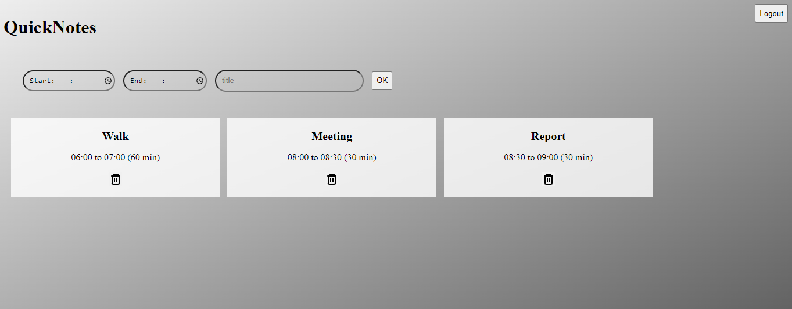

# QuickNotes


[](https://opensource.org/licenses/MIT)



> NodeJS app for quick notes where you can set up memos for activities along your day. I created this project to teach in the Javascript course for beginners at the Fullture School. 

### Progress

The project is still under development and the next updates will focus on the following tasks:

- [x] Javascript with HTML5 storage
- [ ] NodeJS
- [ ] MongoDB
- [ ] Login token

## 💻 Requirements

Before you begin, make sure you've met the following requirements:

* You installed the latest browser version.
* Live Sass compiler.
    * To compile Sass, make sure your Saas compiler is outputing to css folder.
* Live server extension to easily view file updates in browser.

<!-- 
## 🚀 Installing QuickNotes

In order to deploy, follow these steps:
```
<comando_de_instalação> 
```
-->

## ☕ Using QuickNotes

In this version, to use QuickNotes, just open `index.html` file in your browser. In future releases you will need NodeJS to launch it.
<!-- 
```
<using>
``` 
-->


<!-- ## 🤝 Collaborators

<table>
  <tr>
    <td align="center">
      <a href="#">
        <br>
        <sub>
          <b>Name</b>
        </sub>
      </a>
    </td>
    <td align="center">
      <a href="#">
        <br>
        <sub>
          <b>Name</b>
        </sub>
      </a>
    </td>
    <td align="center">
      <a href="#">
        <br>
        <sub>
          <b>Name</b>
        </sub>
      </a>
    </td>
  </tr>
</table>
-->


## 📝 License

The MIT License (MIT)

Copyright (c) 2015 Chris Kibble

Permission is hereby granted, free of charge, to any person obtaining a copy of this software and associated documentation files (the "Software"), to deal in the Software without restriction, including without limitation the rights to use, copy, modify, merge, publish, distribute, sublicense, and/or sell copies of the Software, and to permit persons to whom the Software is furnished to do so, subject to the following conditions:

The above copyright notice and this permission notice shall be included in all copies or substantial portions of the Software.

THE SOFTWARE IS PROVIDED "AS IS", WITHOUT WARRANTY OF ANY KIND, EXPRESS OR IMPLIED, INCLUDING BUT NOT LIMITED TO THE WARRANTIES OF MERCHANTABILITY, FITNESS FOR A PARTICULAR PURPOSE AND NONINFRINGEMENT. IN NO EVENT SHALL THE AUTHORS OR COPYRIGHT HOLDERS BE LIABLE FOR ANY CLAIM, DAMAGES OR OTHER LIABILITY, WHETHER IN AN ACTION OF CONTRACT, TORT OR OTHERWISE, ARISING FROM, OUT OF OR IN CONNECTION WITH THE SOFTWARE OR THE USE OR OTHER DEALINGS IN THE SOFTWARE.

[⬆ Up](#QuickNotes)<br>


# QuickNotes